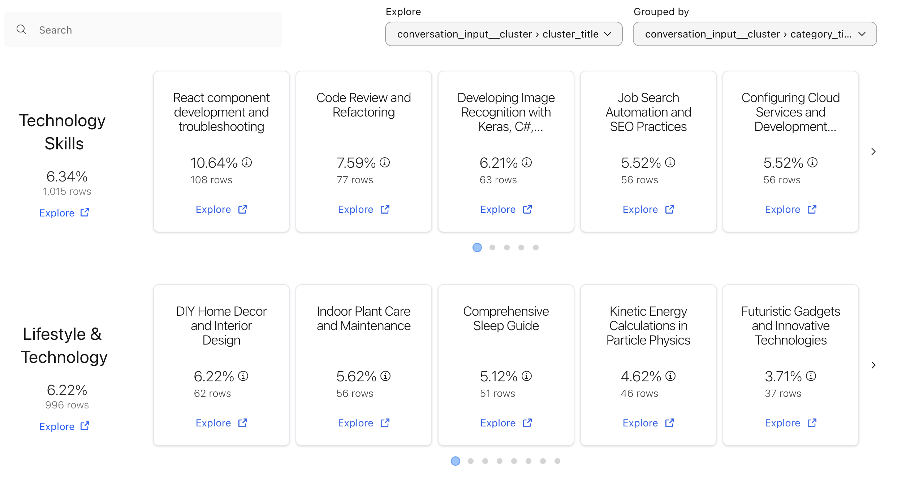
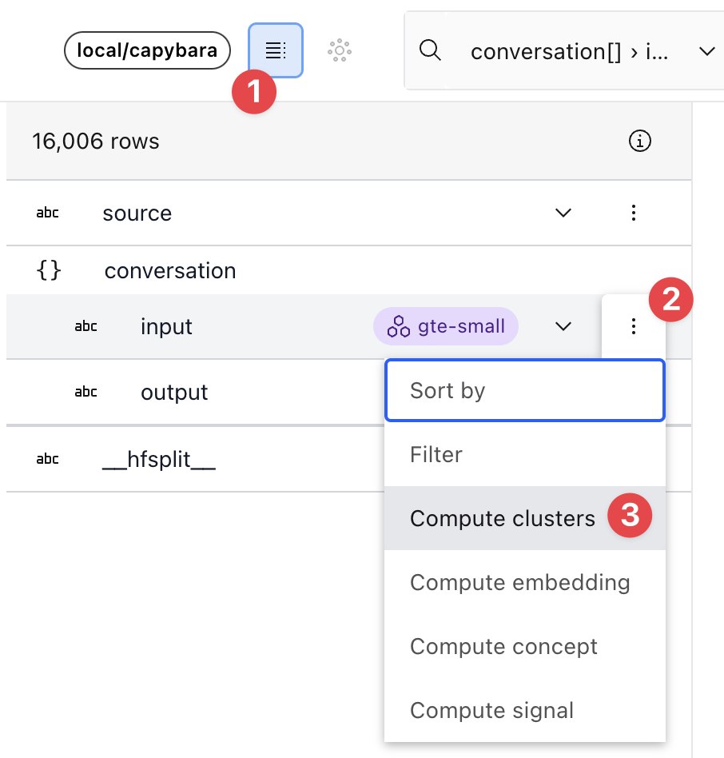
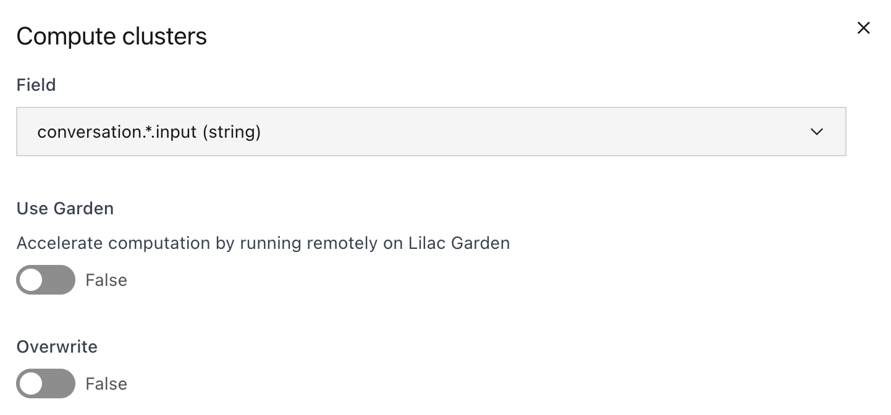
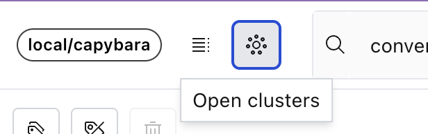

# Cluster a dataset

Clustering is a technique that automatically assigns categories to each document by analyzing the
text content and putting similar documents in the same category. This reveal the overarching
structure of your dataset.

Lilac uses state of the art algorithms and LLMs to cluster the dataset and assign informative,
descriptive titles.

```{note}
Browse <a href="https://lilacai-lilac.hf.space/datasets#lilac/OpenOrca&viewPivot=true&pivot=%7B%22outerPath%22%3A%5B%22question__cluster%22%2C%22category_title%22%5D%2C%22innerPath%22%3A%5B%22question__cluster%22%2C%22cluster_title%22%5D%7D">clusters of 4M OpenOrca</a> documents.
```

<a href="https://lilacai-lilac.hf.space/datasets#lilac/OpenOrca&viewPivot=true&pivot=%7B%22outerPath%22%3A%5B%22question__cluster%22%2C%22category_title%22%5D%2C%22innerPath%22%3A%5B%22question__cluster%22%2C%22cluster_title%22%5D%7D">
  
</a>

Clusters are immediately actionable. You can tag, or simply delete entire clusters from your
dataset, enabling you to remove problematic data with precision.

### Scale and accelerate with Lilac Garden

Clustering on device can be very slow. To dramatically speed up the computation,
[sign up for the pilot](https://forms.gle/Gz9cpeKJccNar5Lq8) of
[Lilac Garden](https://lilacml.com/#garden), our platform for accelerated data processing. Lilac
Garden uses powerful GPUs to embed, cluster and annotate datasets up to 100x faster than on device.
We can cluster a million documents in ~20-30 mins.

<!-- TODO(smilkov): Add this when we have the "promote to a concept" feature -->
<!-- You can also take these clusters and use them to train a [Concept](../concepts/concepts.md), which is a way of pinning a cluster and detecting in-cluster examples across time and different datasets. This is a great way to ensure that
you can continue to detect, track, and address these data points in the future. -->

## From the UI

To cluster a text field, open the schema view, click the expand icon for the field you want to
cluster and select "Compute clusters".





This will schedule a pipeline of dataset operations. To accelerate computation, sign up for
[the Lilac Garden pilot](https://forms.gle/Gz9cpeKJccNar5Lq8) and select the "Use Garden" option in
the Clustering dialog.

When the clustering is complete, you can view the cluster results in the UI, by clicking on the
"Open clusters" button in the header, next to the "Open schema" button.



## From Python

You can cluster a dataset from Python in 1 line of code using [`dataset.cluster`](#Dataset.cluster):

```python
dataset.cluster(input='conversation.*.input', use_garden=True)
```

The output of the clustering is a new field in the dataset, suffixed with `__cluster`, with the
following sub-fields:

- `cluster_id`: The cluster ID of the example. A number between 0 and N-1, where N is the number of
  clusters.
- `cluster_title`: The title of the cluster.
- `cluster_membership_score`: The membership score of the example in the cluster. A number between 0
  and 1, where 1 means that the example is a perfect match for the cluster.
- `category_id`: A high level category ID for the cluster. A number between 0 and M-1, where M is
  the number of categories.
- `category_title`: The title of the category.
- `category_membership_score`: The membership score of the example in the category. A number between
  0 and 1, where 1 means that the example is a perfect match for the category.

When the clustering is complete, you can view the cluster results in the UI (see previous section).
If you want to download the cluster results, see [Export a dataset](dataset_export.md).
