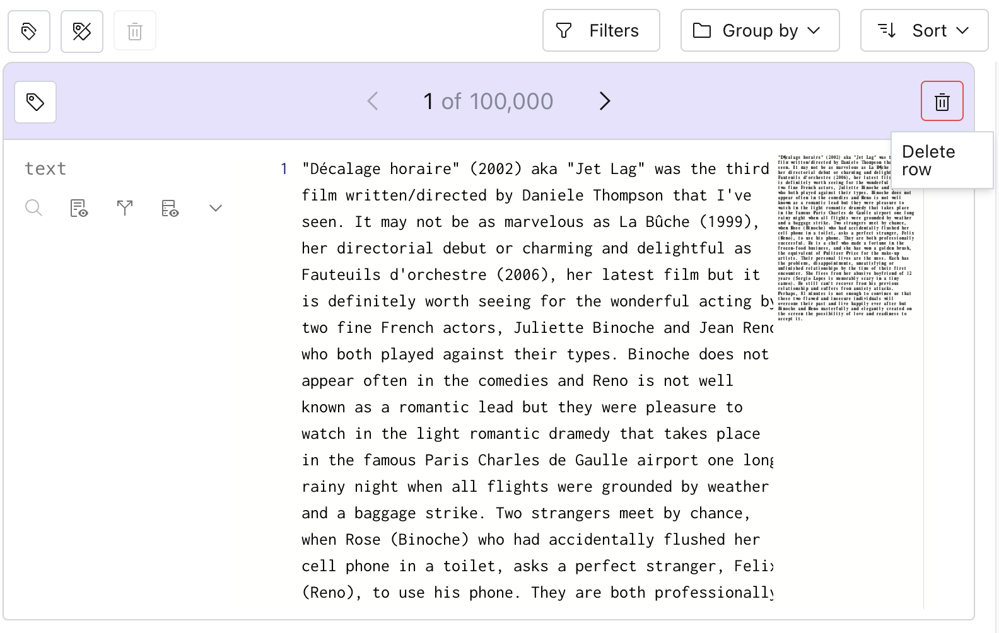
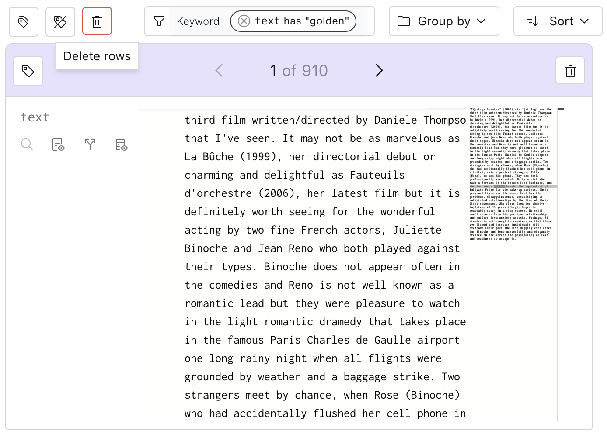
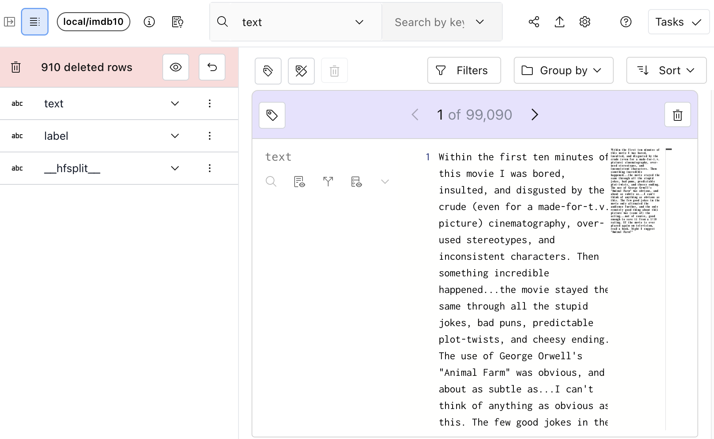
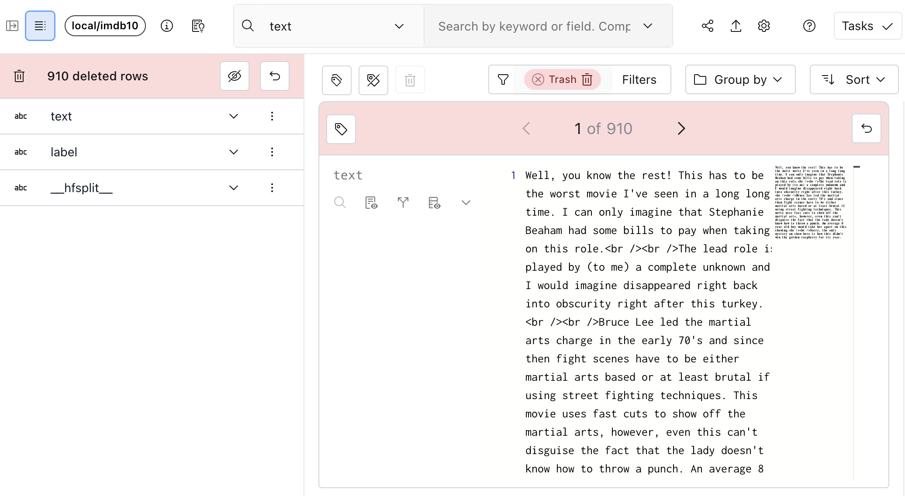

# Deleting rows

## From the UI

Individual rows can be deleted from the UI, and deleted rows can be seen in the trash.

When rows are deleted, they will not be deleted from disk, but are not considered in the number of
rows, searches, filters, and signal computation.

### Single row

To delete a single row from the UI, click the trash icon next to the row, or use the "Delete" or
"Backspace" keys on your keyboard (only in single-item view).

</img>

Once confirmed, the row will be removed from the total count.

### Multiple rows

You can also delete a set of rows in a given filter by using the bulk-delete icon.

In the example below, we've searched for "golden" and we will delete all 910 rows that contain this
keyword.

</img>

### Viewing trashed rows and restoring them

When rows are deleted in Lilac, they are not deleted from disk, so we can always view the trash and
restore them if we made a mistake.

First, let's open the schema to see how many rows we've deleted.

</img>

Clicking the eye-icon will let us view the 910 deleted rows.

</img>

Individual rows can be restored by clicking the "back" arrow. The entire trash can be restored by
clicking the "back" arrow in the schema.

## From Python

First, get the IMDB dataset:

```python
import lilac as ll

ll.set_project_dir('~/my_project')

dataset = ll.get_dataset('local', 'imdb')
```

### Deleting individual rows

We can delete individual rows from Python by using the [](#Dataset.delete_rows) method.

First, let's select the first row and delete it. We need to explicitly ask for the `ROWID` which
uniquely identifies a row. We'll use this to delete the row.

```python
first_row = list(dataset.select_rows(['*', ll.ROWID], limit=1))

row_id = first_row[0][ll.ROWID]
print(row_id)
```

Output:

```bash
0003076800f1471f8f4c8a1b2deda742
```

Let's delete this row.

```python
dataset.delete_rows(row_ids=['0003076800f1471f8f4c8a1b2deda742'])
```

Note that when we delete rows, we actually are just adding a special `__deleted__` label to the row,
which will automatically get reflected in the counts upstream when we query select rows.

We can pass `include_deleted` to select_rows to select over deleted rows. Let's view the deleted
row.

```python
first_row = list(dataset.select_rows(['*', ll.ROWID], limit=1, include_deleted=True))
print(first_row[0])
```

Output:

```py
{
  '__rowid__': '0003076800f1471f8f4c8a1b2deda742',
  'text': 'If you want to truly experience the magic (?) of Don Dohler, then check out "Alien Factor" or maybe "Fiend"...',
  'label': 'neg',
  '__hfsplit__': 'test',
  '__deleted__': {
    'label': 'true',
    'created': datetime.datetime(2023, 9, 20, 10, 16, 15, 545277)
  }
}
```

### Deleting a selection of rows

Deleting individual rows can be cumbersome in Python, so Lilac prosvides a way to delete multiple
rows at the same time through a query selection.

There are two additional arguments to [](#Dataset.delete_rows) which mirror the two arguments in
[](#Dataset.select_rows). See [Querying a Dataset](./dataset_query.md) for more details.

- `searches`: A list of searches to apply to delete rows.
- `filters`: A list of filters to apply to delete rows.

We can use these to delete all results that match the searches and filters.

Let's delete all results that are less than 1,000 characters by using the enriched
`text_statistics.num_characters` field.

```
dataset.delete_rows(
  filters=[
    (('text', 'text_statistics', 'num_characters'), 'less', 1000)
  ]
)
```

### Restoring deleted rows.

Just like [](#Dataset.delete_rows), there is a parallel [](#Dataset.restore_rows) with the same
arguments.

We could restore all rows with:

```
dataset.restore_rows()
```

Or we could restore a single row:

```
dataset.restore_rows(row_ids=['0003076800f1471f8f4c8a1b2deda742])
```

Or we could restore rows in a filter.

```
dataset.restore_rows(
  filters=[
    (('text', 'text_statistics', 'num_characters'), 'less', 1000)
  ]
)
```
